# Arke Architecture Documentation

This document provides visual architecture diagrams for the Arke PKM application.

## Table of Contents

- [System Overview](#system-overview)
- [Core Engine Architecture](#core-engine-architecture)
- [Platform Architecture](#platform-architecture)
- [Data Flow](#data-flow)
- [Plugin System Architecture](#plugin-system-architecture)
- [Sync Architecture](#sync-architecture)

---

## System Overview

High-level view of Arke's architecture showing the core engine, platform shells, and external integrations.

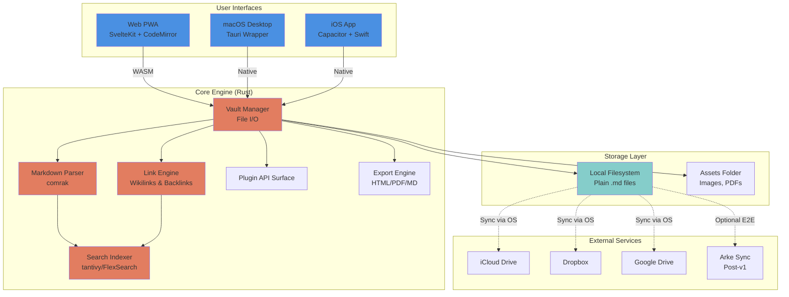

---

## Core Engine Architecture

Detailed view of the Rust core engine and its compilation targets.

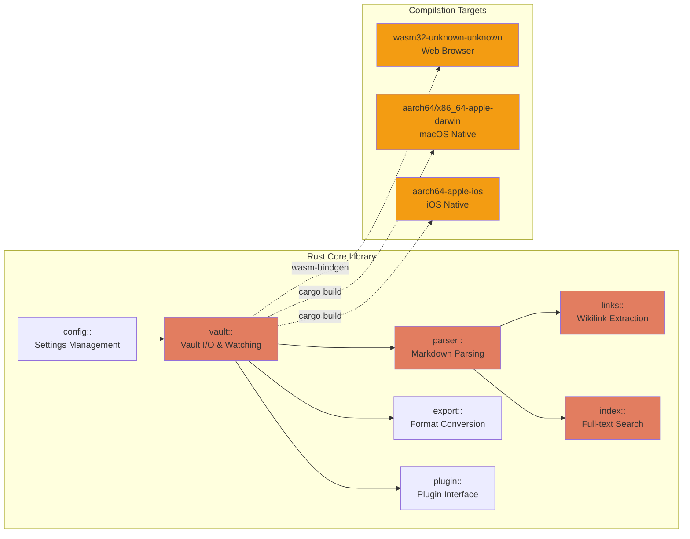

---

## Platform Architecture

How each platform integrates the core engine with its UI layer.

```mermaid
graph TB
    subgraph "Web Platform"
        WebApp[SvelteKit App]
        CM6[CodeMirror 6 Editor]
        WebWorker[Web Workers<br/>Parse & Index]
        WASM_Core[Core Engine WASM]
        FSAccess[File System Access API]

        WebApp --> CM6
        WebApp --> WebWorker
        WebWorker --> WASM_Core
        WASM_Core --> FSAccess
    end

    subgraph "Desktop Platform (macOS)"
        TauriApp[Tauri App Shell]
        WebView[WebView<br/>SvelteKit UI]
        NativeCore[Core Engine Native]
        NativeFS[Native FS APIs]

        TauriApp --> WebView
        TauriApp --> NativeCore
        NativeCore --> NativeFS
    end

    subgraph "Mobile Platform (iOS)"
        CapApp[Capacitor Shell]
        iOSWebView[iOS WebView<br/>SvelteKit UI]
        SwiftBridge[Swift Bridge]
        iOSCore[Core Engine Native]
        FilesProvider[iOS Files Provider]

        CapApp --> iOSWebView
        CapApp --> SwiftBridge
        SwiftBridge --> iOSCore
        iOSCore --> FilesProvider
    end

    style WebApp fill:#4A90E2
    style TauriApp fill:#4A90E2
    style CapApp fill:#4A90E2
    style WASM_Core fill:#E27D60
    style NativeCore fill:#E27D60
    style iOSCore fill:#E27D60
```

---

## Data Flow

Key data flows for common operations.

### File Opening Flow

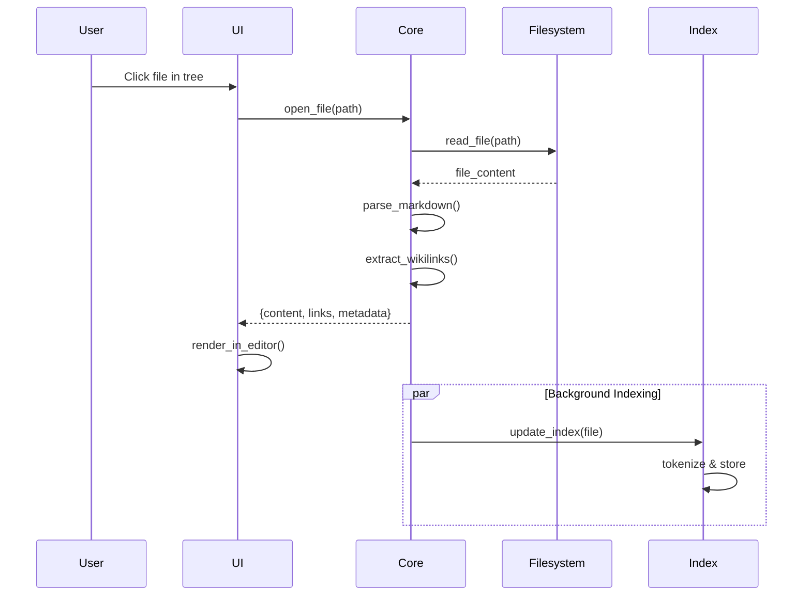

### Search Flow

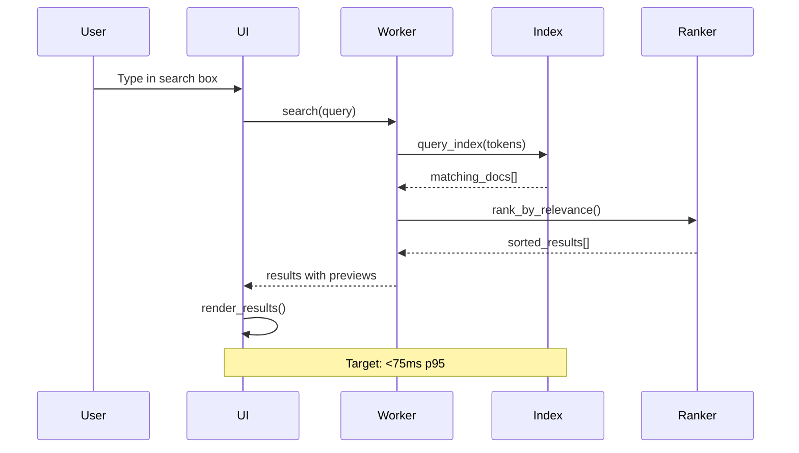

### Link Creation & Backlinks Flow

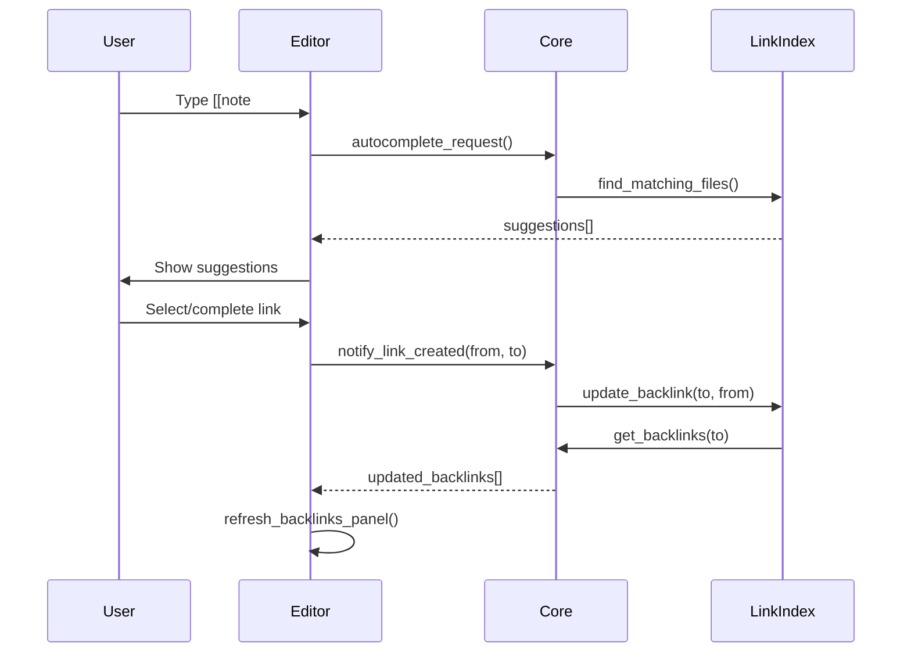

### File Sync & Conflict Detection

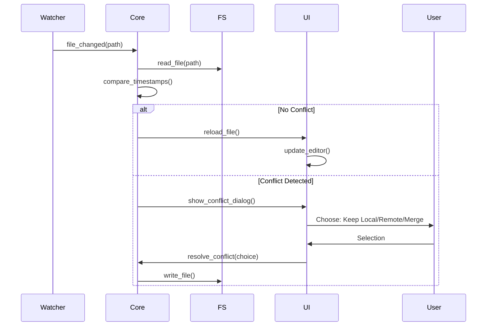

---

## Plugin System Architecture

How plugins integrate with the core system.

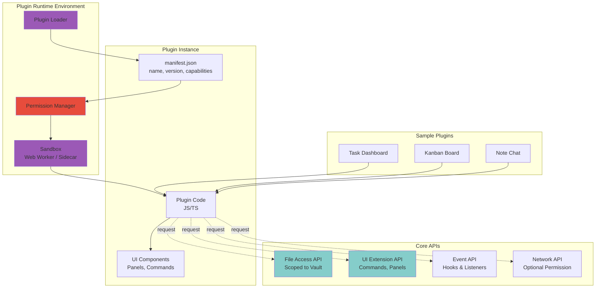

### Plugin Permission Flow

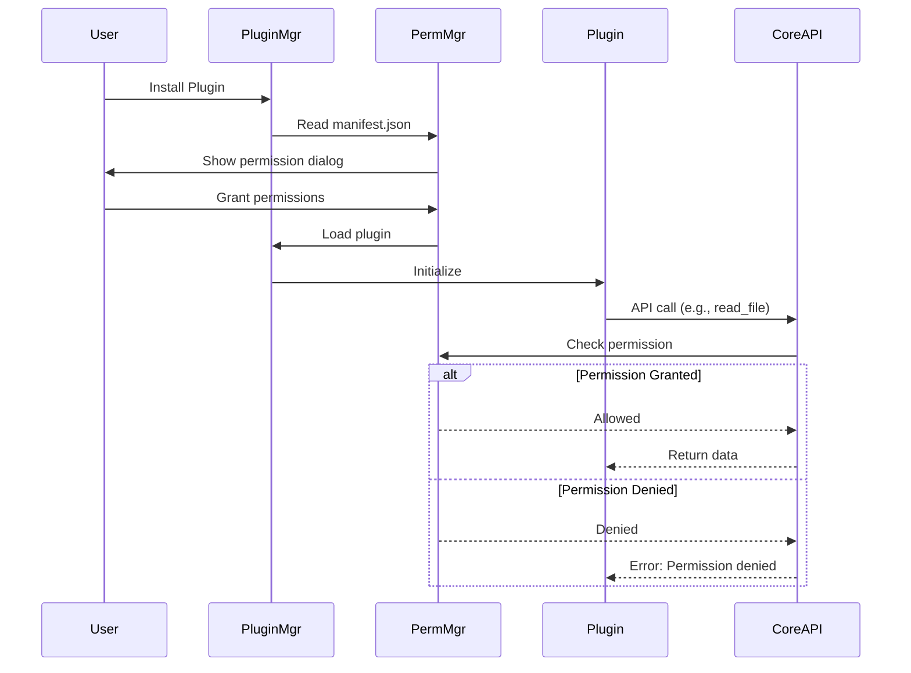

---

## Sync Architecture

How synchronization works across devices.

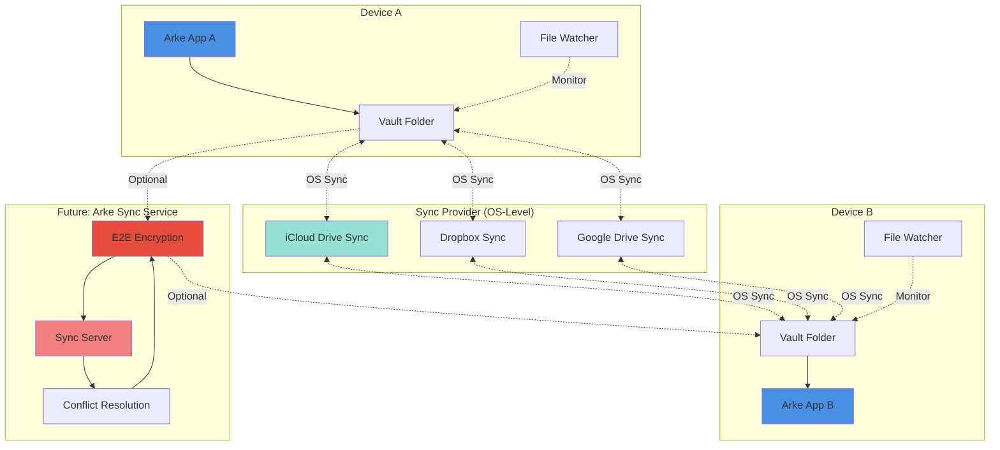

### Conflict Resolution Flow

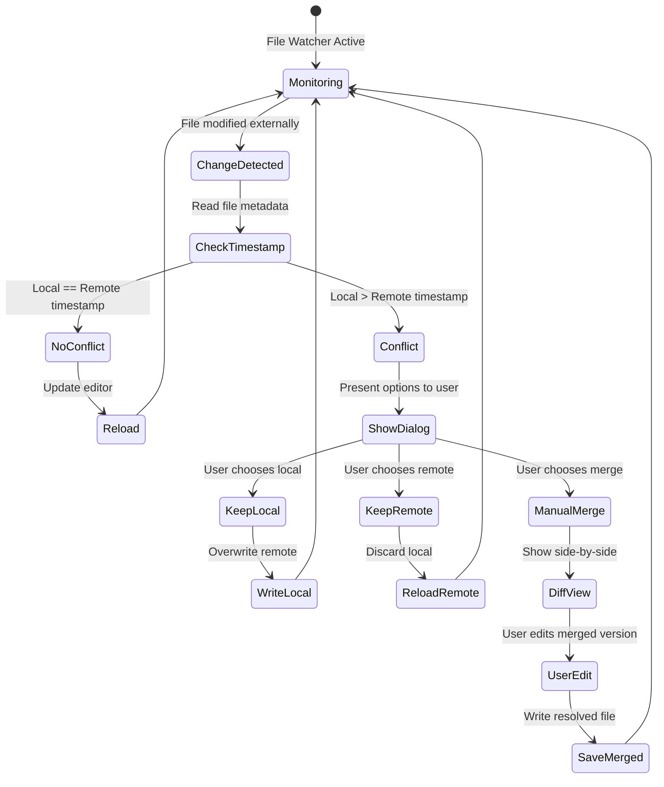

---

## Component Dependencies

Module dependency graph for the core engine.

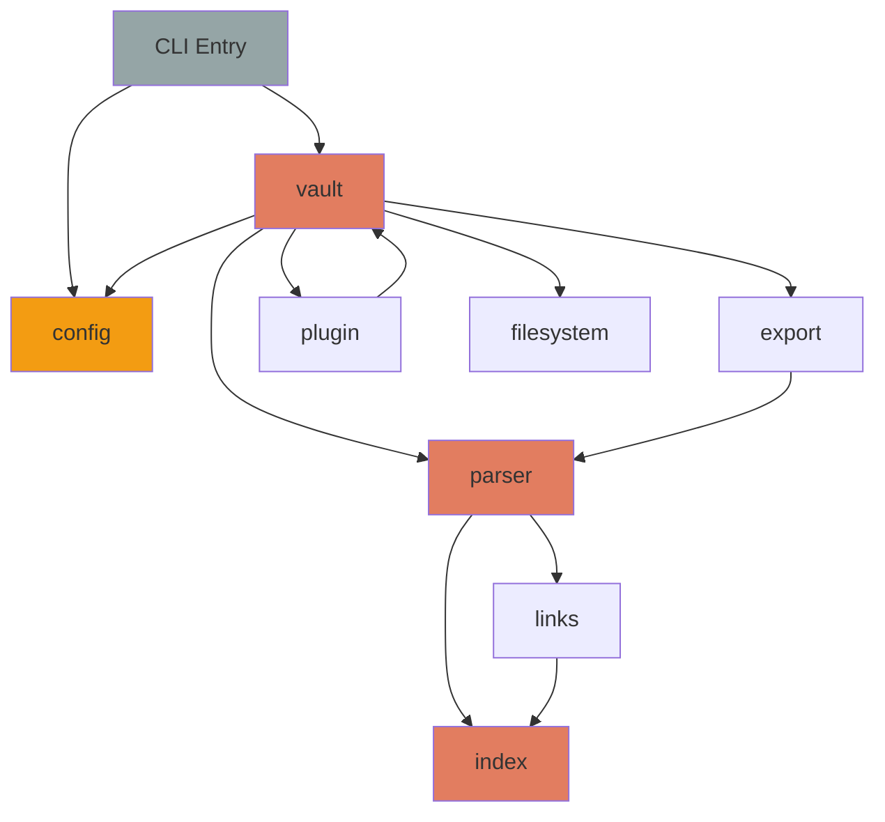

---

## Technology Stack Summary

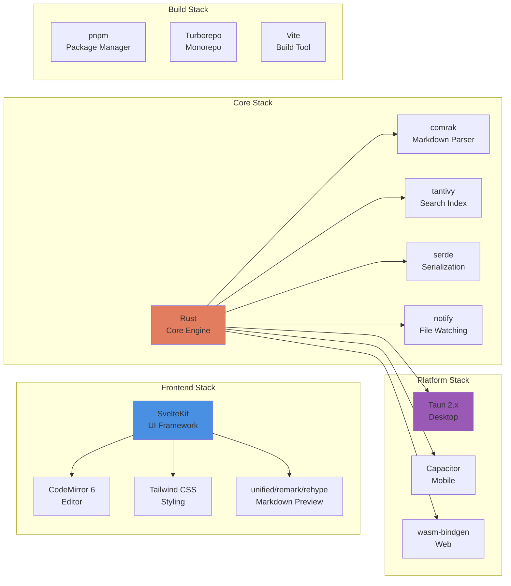

---

## Performance Architecture

Key performance optimizations built into the architecture.

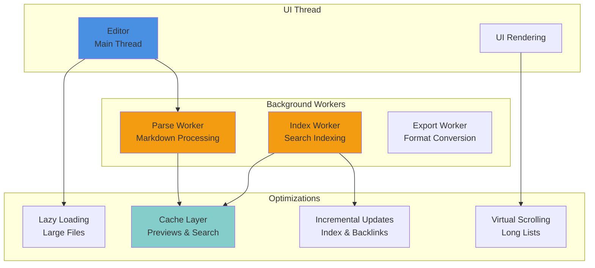

---

## Notes

- **WASM Compilation:** Core Rust engine compiles to WebAssembly for web platform using `wasm-bindgen`
- **Native Compilation:** Same Rust code compiles natively for macOS and iOS with platform-specific file I/O
- **UI Sharing:** SvelteKit app is shared across web, desktop (via Tauri webview), and mobile (via Capacitor webview)
- **Plugin Isolation:** Plugins run in Web Workers (web) or Tauri sidecars (desktop) for security and stability
- **Local-First:** All operations work offline; sync is handled by OS-level file providers or optional Arke Sync service
- **Performance:** Workers prevent blocking UI thread; incremental indexing and caching ensure responsiveness
